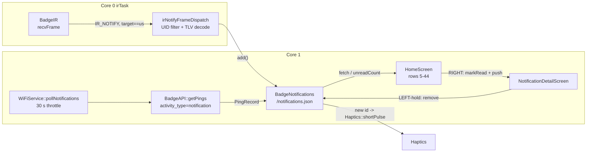

# Legacy Notification System

> Historical note: this document describes the older IR notification/outbox
> design. Current firmware delivers user-visible text messages and zigmojis
> through WiFi `/api/v1/pings`, stores them in `messaging/MessageInbox.*` and
> `messaging/ZigmojiInbox.*`, and renders them through
> `screens/MessagesScreen.*`, `screens/ThreadDetailScreen.*`,
> `screens/MessageComposerScreen.*`, and `screens/ZigmojiScreen.*`. IR
> notification send/receive APIs have been removed from `BadgeIR`; see
> [`../src/README.md`](../src/README.md) for the current source map. The
> remaining sections are retained only as historical design context.

A general-purpose inbox for short messages addressed to this badge.
Notifications are persisted on FAT at `/notifications.json` and fed
from two independent sources:

1. **WiFi** — [`WiFiService`](../src/WiFiService.cpp) polls the
   server's `/api/v1/pings` endpoint every `kNotifyPollMs` (default
   30 s) and hands every returned `PingRecord` to the store.
2. **IR**  — [`BadgeIR`](../src/BadgeIR.cpp) `irTask` on Core 0
   decodes UID-targeted `IR_NOTIFY` frames and calls the store's
   `add()` directly.

Both sources dedup against the store by `id`, so repeat deliveries
never produce duplicate entries or double-buzz haptics.

## Source map

| Concern                        | File |
|--------------------------------|------|
| Store (persistence, dedup)     | [`src/BadgeNotifications.h`](../src/BadgeNotifications.h), [`src/BadgeNotifications.cpp`](../src/BadgeNotifications.cpp) |
| Shared TLV walker + commit     | [`src/BadgeNotifications.cpp`](../src/BadgeNotifications.cpp) — `parseNotifyTlvs`, `commitIncomingFromDecoded` |
| IR frame types + self-echo     | [`src/BadgeIR.h`](../src/BadgeIR.h), [`src/BadgeIR.cpp`](../src/BadgeIR.cpp) |
| Single-frame IR dispatch       | [`src/BadgeNotifications.cpp`](../src/BadgeNotifications.cpp) — `irNotifyFrameDispatch` |
| Multi-frame MANIFEST / DATA    | [`src/BadgeIRNotifyStream.h`](../src/BadgeIRNotifyStream.h), [`src/BadgeIRNotifyStream.cpp`](../src/BadgeIRNotifyStream.cpp) |
| Outbox journal + retry         | [`src/BadgeOutbox.h`](../src/BadgeOutbox.h), [`src/BadgeOutbox.cpp`](../src/BadgeOutbox.cpp) |
| WiFi poll                      | [`src/WiFiService.cpp`](../src/WiFiService.cpp) — `pollNotifications` |
| Home + detail UI               | [`src/GUI.cpp`](../src/GUI.cpp) — `HomeScreen`, `ThreadDetailScreen` |
| Config toggles                 | [`src/BadgeConfig.cpp`](../src/BadgeConfig.cpp) — `kNotifyIrEnable`, `kNotifyPollMs` |

## Architecture at a glance



- `irTask` runs on Core 0; everything else (UI, WiFi, FAT) runs on
  Core 1. Writes into the store from Core 0 and Core 1 serialize via
  a FreeRTOS mutex held inside [`BadgeNotifications.cpp`](../src/BadgeNotifications.cpp)
  (`NotifLock`). `portMUX` would trip the interrupt watchdog during
  FAT writes so the mutex suspends instead.
- Both the IR and WiFi paths eventually call the same `add()` entry
  point. Dedup by `id` means either source can be dropped or replayed
  without corrupting the inbox.

## Store layout (thread-based)

The inbox is a list of **threads** (conversations).  Each thread
carries a sorted list of participant badge UIDs (up to 4) and a
time-ordered list of **messages** (both incoming and outgoing).
Single-peer conversations are the common case; the data model also
supports group chats, though the current UI only creates 1-to-1
threads.

`/notifications.json`:

```jsonc
{
  "threads": [
    {
      "id":            "thr:f5c80deb74fd",      // "thr:<sorted-uids>" or
                                                 // "thr:g<fnv32>"  for groups
      "participants": [
        { "uid": "f5c80deb74fd", "name": "Frosty" }
      ],
      "messages": [
        {
          "id":        "msg:a1b2c3d4",          // shared across IR + API dedup
          "out":       false,                    // true = sent by us
          "senderUid": "f5c80deb74fd",           // empty on outgoing
          "title":     "Boop from Frosty",
          "body":      "hi there!",
          "createdAt": "2026-04-22T12:34:56Z",
          "read":      true
        }
      ],
      "lastUpdatedAt": "2026-04-22T12:34:56Z"
    }
  ]
}
```

- **Thread id**: single-peer threads use `"thr:<sorted-12-hex-uid>"`;
  group threads (4 participants max in the store; UI doesn't create
  them yet) use `"thr:g<8-hex-FNV32>"` computed over the sorted
  joined UIDs so the id fits in `kThreadIdMax = 32`.
- On-disk ordering: threads are stored in insertion order; new
  activity **bumps** a thread to the tail so `fetchThread(0)` (which
  reverse-indexes) returns the most recently active.
- Cap at `kMaxThreads = 16`, `kMaxMessagesPerThread = 30`; the
  oldest head is evicted FIFO when either cap is hit.
- Write path: tmp-file + fsync + rename. Same atomic-swap pattern
  as `/boops.json`.
- Legacy flat `{ "notifications": [...] }` blobs are silently wiped
  on load (detected by the legacy root key) — this is still an
  experimental feature, migrations aren't worth the complexity.

## Public API

```cpp
namespace BadgeNotifications {

struct Message {
  char id[24];
  bool outgoing;
  char senderUid[13];
  char title[40];
  char body[160];
  char createdAt[24];
  bool read;
};

struct ThreadSummary {
  char id[32];
  uint8_t participantCount;
  char participantUids [4][13];
  char participantNames[4][24];
  char lastUpdatedAt[24];
  char lastBodyPreview[40];
  uint8_t messageCount;
  uint8_t unreadCount;
  bool    lastOutgoing;
};

void begin();
void threadIdForPeers(const char* const* peerUids, uint8_t count,
                      char* threadIdOut, size_t cap);

bool addIncoming(const char* peerUid, const char* peerName,
                 const char* id, const char* title, const char* body,
                 const char* createdAt);
bool addOutgoing(const char* peerUid, const char* peerName,
                 const char* id, const char* title, const char* body,
                 const char* createdAt);

int  threadCount();
int  totalUnreadCount();
bool fetchThread(uint8_t index, ThreadSummary* out);

int  messageCountInThread(const char* threadId);
bool fetchMessage(const char* threadId, uint8_t msgIndex, Message* out);

bool markThreadRead(const char* threadId);
bool removeThread(const char* threadId);
void clear();

uint32_t newMessageToken();  // shared cross-transport dedup key
}
```

## IR wire format (protocol v2)

Two flavours share the same TLV payload shape: a single-frame
**fast path** for short messages (~90-byte body ceiling) and a
streaming **MANIFEST / DATA / NEED** path for anything longer.
Both use `kNotifyProtocolVer = 0x02` — this wire has not shipped
yet, so no legacy fallback is implemented.  Both end with an
[`IR_NOTIFY_ACK`](#ack) the sender uses to retire its retry loop.

### Single-frame fast path — `IR_NOTIFY = 0xD0`

```
word0:
  byte0: 0xD0
  byte1: kind (advisory; forwarded into the notification's `kind`)
  byte2: kNotifyProtocolVer (0x02) — frame is dropped if this differs
  byte3: reserved / flags

words[1..2]: TARGET UID (6 bytes, little-endian within the word)
  -> BadgeIR::isSelfEcho() drops any frame whose target != our UID
     so the store never sees stray chatter.

words[3..]: TLV payload, packed as little-endian bytes.
  tag byte  | len byte | <len> bytes
  0x01 = title
  0x02 = body
  0x03 = source UID (exactly 6 bytes, for reply routing)
  0x04 = 16-bit retry nonce (for ACK matching)
  0x05 = 32-bit msg token (cross-transport dedup, little-endian)
  0x00 = explicit terminator (optional)
  (unknown tags are skipped so the wire format can grow)
```

Payload buffer: `120 B` matches the boop v2 DATA frame envelope
(see [`BoopSystem.md`](./BoopSystem.md) §RMT hardware tuning).
Effective body limit after title + sender UID + nonce + msgToken
overhead is ~90 characters of ASCII; `BadgeIR::irBeginNotify`
refuses oversized payloads rather than silently truncating —
oversized sends route through the streaming path below.

### Multi-frame streaming path — `IR_NOTIFY_MANIFEST / _DATA / _NEED`

Introduced in plan 02 Part B to lift the ~90 B body ceiling.
Mirrors the boop v2 exchange protocol, adapted for the asymmetric
notify case (one sender, one target, no symmetric pull).  All
three frame types carry SENDER UID in `words[1..2]` — matches the
boop-style self-echo filter — and rely on the 32-bit `msgToken`
for slot correlation instead of a 16-bit nonce.  Lives in
[`BadgeIRNotifyStream.cpp`](../src/BadgeIRNotifyStream.cpp).

```
IR_NOTIFY_MANIFEST (0xD2) — "I'm about to send msgToken in N chunks":
  word0       : 0xD2 | kind<<8 | ver<<16 | 0<<24
  words[1..2] : SENDER UID (6 B; self-echo filter)
  words[3..4] : TARGET UID (6 B; dispatch-layer target filter)
  word5       : 32-bit msgToken
  word6       : totalChunks<<0 | chunkBytes<<8 | totalBytes<<16

IR_NOTIFY_DATA (0xD3) — one chunk of the flattened TLV payload:
  word0       : 0xD3 | chunkIdx<<8 | ver<<16 | (hasMore&1)<<24
  words[1..2] : SENDER UID
  word3       : 32-bit msgToken (same key the MANIFEST declared)
  word4       : chunkLen<<0 | totalChunks<<8 | reserved<<16
  words[5..]  : chunkLen bytes packed 4/word, zero-padded

IR_NOTIFY_NEED (0xD4) — receiver asks for specific missing chunks:
  word0       : 0xD4 | 0<<8 | ver<<16 | 0<<24
  words[1..2] : SENDER UID of the NEED (= original NOTIFY target)
  word3       : 32-bit msgToken
  word4       : missingChunkBitmap (low 16 bits, bit i = chunk i
                 still missing on the receiver side)
```

Constants ([`BadgeIRNotifyStream.h`](../src/BadgeIRNotifyStream.h)):

- `kChunkBytes = 80` — body bytes per DATA chunk, below the 120 B
  boop-v2 reliable-single-frame envelope.
- `kMaxChunks  = 16`  — 16 × 80 = 1280 B cap (real payloads at
  title 40 + body 160 + ~22 B overhead fit in ≤ 3 chunks).
- `kSenderDeadlineMs = 12000`, `kBurstRetxMs = 2000`,
  `kMaxBurstAttempts = 3` — sender-side timing.
- `kRxNeedDelayMs = 800`, `kRxNeedRetxMs = 1500`,
  `kRxTimeoutMs = 15000` — receiver-side timing.

#### Flow

```
Sender                                   Receiver
======                                   ========
packNotifyPayload()  ──── MANIFEST ───▶   alloc slot (sender UID, token)
                                          record N, totalBytes

  for chunkIdx = 0..N-1:
    ───── DATA[chunkIdx, hasMore] ────▶   copy chunk @ idx*80
                                          mask |= (1<<idx)
                                          if mask == fullMask:
                                             parseNotifyTlvs
                                             addIncoming
                                             ACK(token) ─────▶

                      ... or ...

 (partial burst, then 800 ms quiet)
                     ◀──── NEED(missingMask) ───
  pendingMask = missingMask
  re-TX only missing chunks

                     ◀──── ACK(token) ─────────
  onAckForStreamToken(token)
     → BadgeOutbox::markIrConfirmedByToken
     → haptic fires once
```

#### ACK semantics (shared for both paths)

```
IR_NOTIFY_ACK (0xD1):
  word0       : 0xD1 | kind<<8 | ver<<16 | 0<<24
  words[1..2] : TARGET UID (original sender of NOTIFY / MANIFEST)
  word3       : single-frame  ACK: low 16 bits = echoed nonce
                multi-frame   ACK: full 32 bits = echoed msgToken
```

`BadgeIR::processNotifyAck` checks the streaming slot first
(via `BadgeIRNotifyStream::onAckForStreamToken`); falls through
to the single-frame nonce match only if no streaming sender was
active, so the two semantics coexist on the same wire word
without a mode bit.

#### Dedup

Receiver store keys messages on `"msg:<8-hex-token>"` when TLV 0x05
is present.  Retries of the same NOTIFY frame (or multi-frame
stream) carry the same token so a retransmit collapses to one
record — AND the same token is mirrored into the API's
`data.msg_id` so an IR+API parallel send also dedups.  Legacy
senders without TLV 0x05 fall back to `"ir:<4-hex-nonce><2-hex-kind>"`.

## WiFi poll

`WiFiService::pollNotifications` runs from the normal service tick
(10 s), gated by `notifyPollIntervalMs_` so it only actually issues a
request every 30 s by default. Zero disables polling entirely.

```cpp
GetPingsResult r = BadgeAPI::getPings(uid_hex, myTicket,
                                      "notification",
                                      /*limit=*/BADGE_PINGS_MAX_RECORDS,
                                      /*before_ts=*/nullptr,
                                      /*before_id=*/nullptr);
```

- Requires the badge to be enrolled — `BadgeStorage::loadMyTicketUUID`
  must return a non-empty UUID. Pre-enrollment badges silently skip.
- Each `PingRecord` becomes an incoming message via
  `BadgeNotifications::addIncoming`:
  - `peerUid` / `peerName` come from a `/boops.json` lookup keyed on
    `source_ticket_uuid`; unresolved senders land in the generic
    "thr:server" thread.
  - `id` preferred: `"msg:<data.msg_id>"` (shared with IR for cross-
    transport dedup); falls back to `"ping:<first-18-of-record-id>"`.
  - `title`: `data.title` JSON field, falling back to `activity_type`.
  - `body`: `data.body` or `data.text`, falling back to the raw
    `data` JSON string.
  - `createdAt`: record's `created_at`.

The server-side pings endpoint already attaches HMAC auth inside
[`BadgeAPI.cpp`](../src/BadgeAPI.cpp) — no new auth plumbing needed.

## Home screen (thread list)

Rows 0..8 are shared header chrome and rows 54..63 are the shared footer
action band. Rows 9..53 are the **thread list** — one row per conversation
(not per message), with the most recently active thread at the top.

```
row  0..8 : shared title/status header
row  9..21: + New / thread 0
row 22..34: thread 1
row 35..47: thread 2
row 48..53: thread 3 preview tail
row 54..63: shared footer action band
```

- Each row: `<bullet> <participant name>` (and `(N)` for multi-
  unread-count).  Fallback when the name slot is empty: `Peer 74fd`
  using the last 4 hex of the UID so the row is still actionable.
- Cursor row is inverted (white fill / black glyphs); other rows
  are black fill / white glyphs.  u8g2 XOR mode was tried first and
  produced solid black blocks against the filled chrome pixels.
- Inputs:
  - Joystick Y (80/160/300 ms auto-repeat): move cursor.
  - Semantic confirm: `markThreadRead(threadId)` + push `ThreadDetailScreen`.
  - Semantic cancel: push `kScreenMainMenu`.

Empty state: "No boops yet" centered in the list band.

## Thread detail screen (chat view)

Pushed by `HomeScreen` with a one-shot `setThreadId(threadId)` seed.
`onEnter` calls `markThreadRead` so the Home bullet clears the
moment the user opens a thread.

### Layout — iMessage-style monochrome bubbles

Bottom-anchored phone-chat convention: newest message sits at the
bottom of the list band, older messages stack upward.  Each message
is a rounded-rectangle bubble sized to its text.

Regions:

- Header (rows 0..12): thread display name in `FONT_SMALL`,
  underlined at row 12.
- Bubble band (rows 13..56): message bubbles, laid out bottom-up in
  `u8g2_font_5x7_tr` (one step up from the global `FONT_TINY`/4x6
  preset; set via `oled::setFont()` directly so other FONT_TINY
  callers — footers, confirm screen, nametags — are unaffected).
  Bubbles word-wrap at up to 2 lines each and truncate with an ASCII
  `...` when the body overflows.  U+2026 is out of reach because
  `_tr` fonts are ASCII-only; the wrap helper caps its buffer writes
  so the three dots always fit.
- Footer (row 62): B back always; A reply whenever the thread
  has a primary participant we can target.

Bubble visual language — the 1-bit reduction of iMessage:

- Outgoing messages: filled rounded rectangle right-aligned with a
  2 px margin from the right screen edge, drawn at radius 3 on the
  three "normal" corners.  Text in color 0 (black on the white
  fill).
- Incoming messages: outlined rounded rectangle left-aligned with a
  2 px margin from the left edge, same 3-px radius.  Text in color
  1 (white glyphs against the black background inside the frame).
- Asymmetric tail: on bubbles that carry a tail, the tail-side
  bottom corner is squared (the rounded-corner notch is re-filled
  with a single pixel) and a 2-pixel hook extends one column
  outward at the bubble's bottom row.  The three non-tail corners
  stay rounded.  This is the 1-bit distillation of iMessage's
  curved "droplet" tail.
- Run grouping: consecutive bubbles from the same sender use a
  tight 1 px vertical gap instead of the 3 px cross-sender gap, and
  ONLY the newest bubble of each run draws a tail.  Older bubbles
  in the same run render as plain tail-less rounded rectangles.
- No per-message selection.  Mirroring iOS Messages, the thread view
  has no cursor/highlight — joystick Y just scrolls.  Every
  bubble renders in its natural state (filled-outgoing,
  outlined-incoming) regardless of scroll position.

The fill-vs-outline dichotomy is the 1-bit analogue of iMessage's
blue-vs-grey: outgoing "pops" harder than incoming.

### Variable-height scroll math

Because bubble heights depend on wrapped line count (1 line ≈ 10 px
tall including padding at 5x7, 2 lines ≈ 18 px), the screen can't
compute "visibleCount" analytically.  It's a single-pass layout:

- `scroll_` is the newest-first index of the bubble pinned to the
  bottom of the band (0 = pinned to the newest message).
- Every `render()` re-runs layout from `scroll_` upward, stops when
  the next bubble would overflow the top of the band, and records
  `topmostVisibleIdx_` (the oldest fully-visible bubble) for the
  frame.
- `scrollBy(+1)` consults that cache: it only advances `scroll_`
  when `topmostVisibleIdx_ + 1 < total`, i.e. there's an older
  message not yet on screen.  This prevents scrolling past the
  oldest when it's already fully visible at the top of the band.
- `scrollBy(-1)` just clamps at `scroll_ == 0` (newest pinned).

### Inputs

- UP / joystick-up: scroll to **older** history (raise `scroll_`).
  Phone-chat convention — opposite polarity from the top-newest
  Home screen.
- DOWN / joystick-down: scroll to **newer** history (lower
  `scroll_`, toward the bottom).
- RIGHT: open the keyboard pre-seeded to reply to the thread's
  primary participant (current UI is 1-to-1; group broadcast is
  future work).
- LEFT short-press: `popScreen()`.
- LEFT long-press (≥ 800 ms): delete the entire thread with a
  60 ms haptic pulse.

## Sending (`BadgeOutbox` → parallel IR + API rails)

Composer surface lives in [`GUI.cpp`](../src/GUI.cpp)
`SendBoopBackground` (a namespace, not a screen).  All entry points
funnel through the single helper
`SendBoopBackground::launchFor(gui, peerUid, peerTicket, peerName,
skipConfirm=false)` which seeds the target, pulses the haptic, and
pushes the keyboard.  Triggered from:

- Main Menu → "New Msg" → Contacts pick mode → pick peer
  (`ContactsScreen::onItemSelect` in pick mode).
- ContactDetail → ">> New Msg <<" row
  (`ContactDetailScreen::onItemSelect` `FieldKind::SendBoop`).
- `ThreadDetailScreen::replyHere` → RIGHT.  Passes
  `skipConfirm=true` so the post-send toast is suppressed and the
  thread chat immediately shows the sent bubble.

Menu vocabulary: the pairing action is "Pair" (IR handshake that
creates a contact); starting a conversation is "New Msg"; the thread
list is reached via "Messages" (which pushes `kScreenHome` — the
existing thread list screen).  "Boop" remains the internal verb for
the IR pairing handshake inside [`BoopScreen`](../src/BadgeBoops.cpp)
code, but the menu labels describe outcomes so users don't have to
read source to reason about them.

Flow on `beginAfterBody()` (post-plan 02 Part A):

1. `newMessageToken()` mints a 32-bit shared dedup key.
2. `addOutgoing(peerUid, name, "msg:<token>", title, body, "")` — the
   user's own message appears in the thread immediately.
3. `BadgeOutbox::enqueue(...)` persists the entry to
   `/outbox.json` and the outbox retry task kicks IR + API
   **in parallel from t=0**.  No more "IR first, API on timeout".
4. Optional `SendBoopConfirmScreen` toast (suppressed on thread
   reply).

The retry task ([`BadgeOutbox::retryTask`](../src/BadgeOutbox.cpp))
runs on Core 1 at 1 s cadence.  For each pending entry it:

- Chooses the right IR path per message size
  ([`BadgeOutbox::kickIrAttempt`](../src/BadgeOutbox.cpp)):
  - `bodyLen ≤ irSingleFrameBodyBudget(title, haveMsgToken=true)`
    → `irBeginNotifyAndReport` (single-frame, nonce-correlated).
  - Oversize → `BadgeIRNotifyStream::irBeginNotifyStream`
    (MANIFEST + chunks, msgToken-correlated).
- Fires an API `sendPing` in parallel via a one-shot Core 1 worker
  task (`kickApiAttempt` / `apiWorkerTask`).  The POST body
  includes `"msg_id": "<8-hex-token>"` so both rails collapse to
  one record on the receiver's dedup key.
- Retires the entry once **any** rail confirms, firing exactly
  one haptic pulse (`maybeFireHaptic`).
- Times entries out after `kOutboxMaxAgeMs = 120_000` (2 min).
- Survives reboots via `loadFromDisk`, resetting any `in_flight`
  rails to `pending`.

### Part B routing detail

The two ACK flavours (single-frame nonce vs multi-frame msgToken)
coexist on the same wire word — `BadgeIR::processNotifyAck`
consults `BadgeIRNotifyStream::onAckForStreamToken(word3)` first
and falls through to the single-frame nonce match only if no
streaming sender was active.  Outbox correlation uses:

- `BadgeOutbox::markIrConfirmed(uint16_t nonce)` /
  `markIrAttemptFailed(nonce)` — single-frame path.
- `BadgeOutbox::markIrConfirmedByToken(uint32_t token)` /
  `markIrAttemptFailedByToken(token)` — streaming path.

Both honour the `ir_block` test-harness sim — confirmation is
suppressed and the rail flips back to `pending` so the retry
loop fires a fresh attempt.

## Config toggles

All in the `[notifications]` section of `/settings.txt`:

| Key            | Range            | Default | Effect                                                           |
|----------------|------------------|---------|------------------------------------------------------------------|
| `notify_ir`    | 0 / 1            | 1       | Drive `irNotifyListening`; 0 stops background IR RX.             |
| `notify_poll`  | 5000 – 600000 ms | 30000   | Minimum spacing between `BadgeAPI::getPings` calls. 0 disables.  |

Live-toggle: `ConfigWatcher` notices `/settings.txt` changes and
invokes `Config::apply(kNotifyIrEnable)` / `apply(kNotifyPollMs)`,
which respectively flip `irNotifyListening` and call
`wifiService.setNotifyPollIntervalMs` so either knob lands without
a reboot.

## Open / future work

- **Group chat UX**: the store already supports multi-participant
  threads (`kMaxParticipants = 4`, stable `thr:g<fnv32>` id), but
  the UI only creates 1-to-1 threads.  A "group" compose flow would
  let the user pick multiple contacts as participants and broadcast
  outgoing messages to each peer individually (reusing the same
  msgToken so receivers recognize it as a group message).
- **Name resolution**: incoming messages often land with an empty
  participant name (before the peer has been paired via
  `/boops.json`).  A background pass that re-walks threads after a
  new contact is added would backfill the missing names.
- Unread-count glyph on the Home chrome so the user can tell there's
  something new from outside the list.
- Auto-prune of read threads older than N days to keep the journal
  from churning the FAT partition.
- Richer activity types — the server's `activity_type` can already
  carry things like `queue_turn` / `room_checkin`; add specific
  icons / haptic patterns when the field matches known values.
