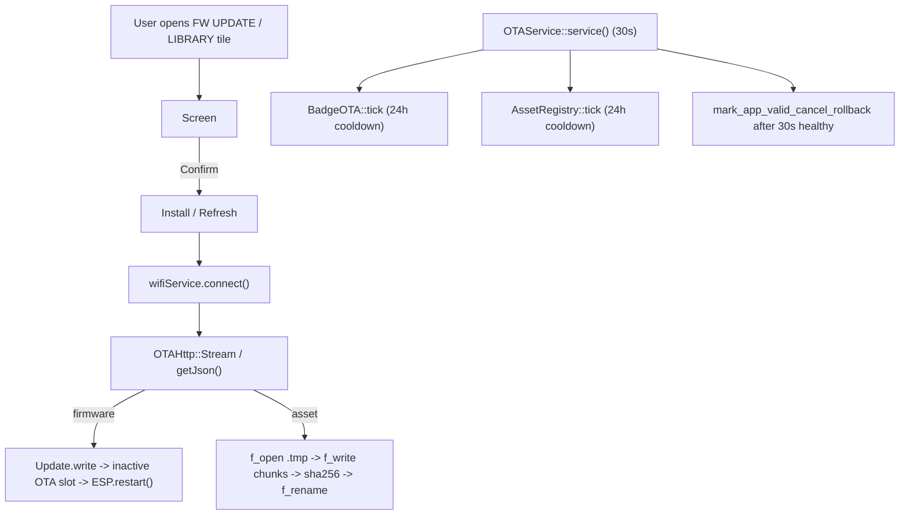

# OTA & Asset Registry — Continuation Brief

> Hand this to a fresh chat session to pick up the OTA / asset
> registry work. Goal of the **next** session: get DOOM's `doom1.wad`
> (and similar large user-installable files) actually downloading
> end-to-end on a real badge.

## TL;DR of what already exists

The badge has a fully wired OTA + Asset Registry system. Code is
shipped, builds clean, partition layout is OTA-frozen and safe.
What's missing is the operational tail: a real hosted WAD, end-to-end
testing on a physical badge, and the polish items listed in
[§ Open work](#open-work) below.

## Files you'll touch

| Concern | File |
|---|---|
| Firmware OTA façade | [firmware/src/ota/BadgeOTA.{h,cpp}](../src/ota/BadgeOTA.cpp) |
| Asset registry façade | [firmware/src/ota/AssetRegistry.{h,cpp}](../src/ota/AssetRegistry.cpp) |
| Shared HTTPS helper | [firmware/src/ota/OTAHttp.{h,cpp}](../src/ota/OTAHttp.cpp) |
| Daily-cadence service | [firmware/src/ota/OTAService.{h,cpp}](../src/ota/OTAService.cpp) |
| FW update screen | [firmware/src/screens/UpdateFirmwareScreen.{h,cpp}](../src/screens/UpdateFirmwareScreen.cpp) |
| Asset Library screens | [firmware/src/screens/AssetLibraryScreen.{h,cpp}](../src/screens/AssetLibraryScreen.cpp) |
| Settings keys | [firmware/src/infra/BadgeConfig.{h,cpp}](../src/infra/BadgeConfig.cpp) — search `otaManifestUrl` / `assetRegistryUrl` |
| Home tiles | [firmware/src/ui/GUI.cpp](../src/ui/GUI.cpp) — `kCuratedMenuItems` |
| Status-bar update glyph | [firmware/src/ui/OLEDLayout.cpp](../src/ui/OLEDLayout.cpp) and [firmware/src/ui/UpdateIcon.h](../src/ui/UpdateIcon.h) |
| DOOM WAD-missing redirect | [firmware/src/doom/DoomScreen.cpp](../src/doom/DoomScreen.cpp) — `renderNoWadScreen` / Confirm handler |
| Registry seed | [registry/registry.json](../../registry/registry.json) + [registry/README.md](../../registry/README.md) |
| Release Action | [.github/workflows/release-firmware.yml](../../.github/workflows/release-firmware.yml) |
| Maintainer guide | [firmware/docs/OTA-MAINTAINER.md](OTA-MAINTAINER.md) ← read this first |
| Project rules / gotchas | [CLAUDE.md](../../CLAUDE.md) |

## Architecture (4-bullet summary)

1. **Two independent systems**, sharing transport via `OTAHttp`:
   - `BadgeOTA` — pulls firmware from GitHub Releases, daily check,
     installs via `Update.write` into the inactive OTA slot, reboots.
   - `AssetRegistry` — pulls a `registry.json` from a configurable
     URL, lets users install individual entries (DOOM WAD, etc.) into
     `/<dest_path>` on FatFS via atomic `<dest>.tmp` + `f_rename`.
2. **Daily cadence** — `OTAService` (low-priority `IService`) ticks
   every 30 s. Both systems guard internally against a 24 h
   cooldown that's persisted in NVS. Manual "Check now" /
   "Refresh" actions ignore the cooldown.
3. **No security ceremony** — open-source firmware, no signing, no
   cert pinning (`setInsecure()`), no PIN/auth. SHA-256 in registry
   entries is a corruption check, not a signature. The only
   defenses are anti-bricking (battery ≥ 30 % gate, bootloader
   rollback after 30 s healthy boot, atomic file rename).
4. **OTA is filesystem-safe** — a v0.2.0 → v0.3.0 OTA never touches
   ffat. `provisionStartupFiles(false)` on first boot of the new
   firmware preserves user-modified files via FNV-1a hash check.
   Only explicit double/triple-confirmed actions (Expand Storage
   button, `erase_and_flash_expanded.sh`) wipe user data.



## What's NOT done yet — open work in priority order {#open-work}

### 1. ~~Get a real `doom1.wad` URL into `registry.json`~~ — DONE

The WAD now ships as a GitHub Release attachment. The pipeline:

- [`release-assets/manifest.json`](../../release-assets/manifest.json)
  declares which files the release Action attaches to every release.
  Each entry can source from `local_path` (preferred) or
  `fallback_url` (when the file is gitignored, like `doom1.wad` is).
- [`scripts/stage_release_assets.py`](../../scripts/stage_release_assets.py)
  is the staging logic. Run with `--check` locally to verify your
  manifest + registry are consistent before pushing.
- [`.github/workflows/release-firmware.yml`](../../.github/workflows/release-firmware.yml)
  invokes the staging script, then uploads `artifacts/release/*` so
  the firmware binary AND every bundled asset land on the release.
- [`registry/registry.json`](../../registry/registry.json) points the
  WAD entry at the stable
  `https://github.com/<owner>/<repo>/releases/latest/download/doom1.wad`
  URL — that doesn't change between firmware releases, so the badges'
  cached registry stays valid forever.

The path is generic. Any future file too big for
`firmware/initial_filesystem/` (≳ 100 KB — sound packs, fonts,
optional apps, alternate WADs) just adds an entry to both
`release-assets/manifest.json` and `registry/registry.json` and
ships on the next release. Full workflow in
[OTA-MAINTAINER.md § 2](OTA-MAINTAINER.md).

### 2. End-to-end install test on a real badge

The code path has been compile-verified but never exercised on
hardware against a real download. Smoke test:

1. Flash a fresh badge: `cd firmware && pio run -e echo -t upload`
2. Configure WiFi via Settings → WiFi Setup.
3. Open `LIBRARY` tile → DOOM 1 Shareware → Confirm install.
4. Watch progress bar fill, expect "Installed!" then back to the
   library showing `OK v1.9` for the entry.
5. Open `DOOM` tile → should boot straight into the game (no
   "no WAD" prompt).
6. Reboot the badge — DOOM should still launch (file persists).

If something fails, the install path logs `[registry]` lines on
serial. Likely failure modes are listed in
[OTA-MAINTAINER.md § 6](OTA-MAINTAINER.md).

### 3. Improve progress reporting

Right now `AssetDetailScreen::progressCb` repaints the whole screen
on every chunk. Smooth enough for the 4 MB WAD but visibly choppy.
Options:

- Throttle re-renders to ~10 Hz max (cap on `lastReport` interval).
- Add a download speed estimate ("245 KB/s") for psychological win
  during the long DOOM download.
- Show estimated time remaining when `total > 0`.

### 4. Cancel during install

There's currently no way to abort a download once it starts. Add a
`Cancel` action that sets a flag the install loop polls between
chunks, then truncates `.tmp` and bails cleanly.

### 5. Resume on partial download

If WiFi drops mid-WAD, the install fails and the user has to start
over. Could implement Range-request resume: keep `.tmp` around with
its current size, on retry send `Range: bytes=N-` and append. Adds
complexity; only worth doing if conference WiFi proves flaky.

### 6. Optional: add a 2nd registry asset

Pick anything small to validate the multi-asset path (a sound pack?
A bonus app's icon set?). Confirms `cachedCount_` iteration works
and the screen scrolls correctly past one entry.

## Hard constraints and gotchas

These will bite you if you forget:

- **Partition table is OTA-frozen.** Never touch
  [firmware/partitions_replay_16MB_doom.csv](../partitions_replay_16MB_doom.csv).
  Every shipped badge has this layout. The expanded variant
  ([firmware/partitions_replay_16MB_ver2.csv](../partitions_replay_16MB_ver2.csv))
  is opt-in only via `firmware/scripts/erase_and_flash_expanded.sh`.
  See [OTA-MAINTAINER.md § 5](OTA-MAINTAINER.md).
- **Use `~/.platformio/penv/bin/pio` directly**, never the system
  `pio` shim — pyenv resolves to the wrong Python and fails with
  fatfs import errors. `build.sh` and `start.sh` handle this
  automatically; ad-hoc commands need the explicit path.
- **Never use bare button letters in user-facing copy** (on-device or
  in docs). Always route hint / status text through
  `ButtonGlyphs::drawInlineHint(...)`. The badge buttons rotate on
  nametag flip and confirm/cancel can be swapped via
  `kSwapConfirmCancel`. Header banner at
  [firmware/src/ui/ButtonGlyphs.h](../src/ui/ButtonGlyphs.h) has the
  full token list. SVG glyphs for docs are in
  `Jumperless-docs/docs/img/badge-buttons/` (regen via
  `firmware/scripts/render_button_glyphs_svg.py`).
- **FATFS is single-threaded.** Always wrap any direct `f_*` call in
  a `Filesystem::IOLock` (RAII). The `AssetRegistry::install` path
  already does this for the whole download — don't drop the lock to
  yield, the FATFS struct's directory cluster bookkeeping will get
  corrupted by interleaving writers (this caused the
  "f|/{"entrie.s":|0" bug in the boops journal in April 2026).
- **Use `fs->ssize` for FATFS sector size**, not hardcoded 512 — this
  build sets `MICROPY_FATFS_MAX_SS = 4096` and the actual sector
  size is dynamic. See `BadgeOTA::ffatVolumeBytes()` for the
  reference pattern.
- **Battery ≥ 30 %** gate on firmware install (no gate on asset
  installs — they're recoverable, the worst case is a half-written
  `.tmp` that gets cleaned up next try).
- **Kill `serial_log.py` before flashing** — it competes with the
  flash worker for the USB port. `pkill -f serial_log.py` first.
- **The expanded partition layout has its own future tail** —
  [OTA-MAINTAINER.md § 5 "What about OTA after opting in?"](OTA-MAINTAINER.md)
  describes the dual-asset OTA path that may eventually need to be
  built. Don't conflate it with the WAD download work; they're
  independent.

## Quick test commands

```bash
# Build (echo env, the production OTA target)
cd firmware && ~/.platformio/penv/bin/pio run -e echo

# Flash + uploadfs over USB (full filesystem rebuild)
cd firmware && ~/.platformio/penv/bin/pio run -e echo -t upload
cd firmware && ~/.platformio/penv/bin/pio run -e echo -t uploadfs

# Live serial logs (kill before flashing!)
cd firmware && python3 serial_log.py

# Compute SHA-256 of a file for registry.json
sha256sum doom1.wad

# Verify the registry.json parses cleanly before pushing
python3 -c "import json; json.load(open('registry/registry.json'))"

# Hit the registry URL the way the badge would (User-Agent matters
# for some hosts)
curl -A "TemporalBadge-OTA/1.0" -i \
  https://raw.githubusercontent.com/Architeuthis-Flux/Temporal-Replay-26-Badge/main/registry/registry.json
```

## On-screen UX recap

- Status bar (top of every screen): a small down-arrow glyph appears
  immediately to the left of the WiFi icon when a firmware update
  has been cached. Sourced from
  [firmware/src/ui/UpdateIcon.h](../src/ui/UpdateIcon.h).
- Home grid: `FW UPDATE` tile (label flips to `UPDATE` when an
  update is cached, with a notification badge dot via the existing
  `badgeFn` mechanism). `LIBRARY` tile (only visible when
  `asset_registry_url` is set in `settings.txt`).
- DOOM with no `/doom1.wad`: the "No DOOM WAD" screen now shows
  `Confirm` to jump straight to the **AssetDetail** page for the
  WAD entry (skipping the library list — one fewer button press).
  Falls back to the library if the registry hasn't been refreshed
  yet, so the library's first-open auto-refresh still kicks. The id
  `doom1-shareware` is hardcoded in
  [DoomScreen.cpp](../src/doom/DoomScreen.cpp) — match the registry.
- FW UPDATE screen: status rows at y=18, 27, 36, 45. Status warnings
  (WiFi off, no asset, newer-than-published) displace the
  `Last check:` row when active. The `FS:` row is always shown
  when the FS is mounted; appends an X-button glyph + "expand N.N"
  affordance only when `ffatExpansionAvailable()` returns true.
